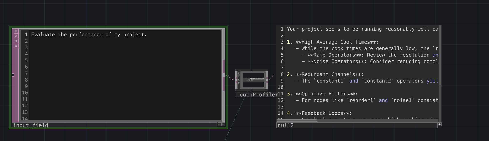
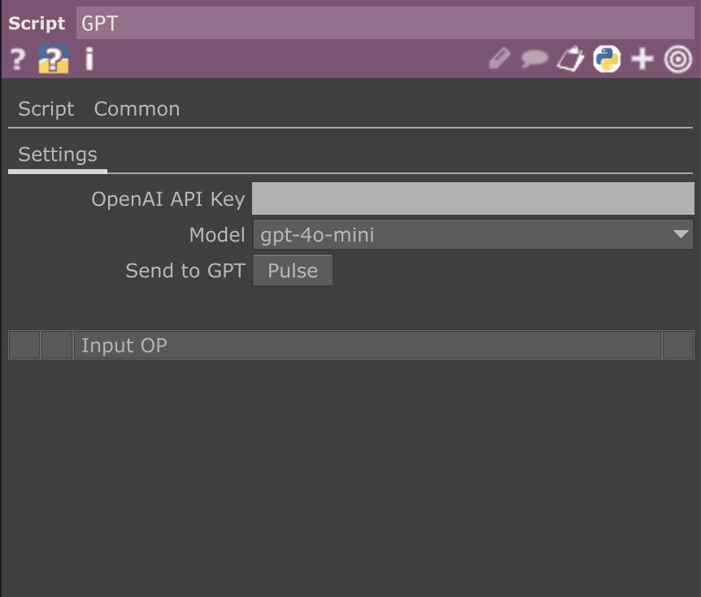

# TouchProfiler

**TouchProfiler** is a modular performance diagnostics framework for TouchDesigner — designed for creators who need deep, actionable insight into the real-time behaviour of their networks.

It captures cook-time metrics, GPU load, memory usage, and dependency structures, then integrates with OpenAI's GPT API to provide intelligent, contextual optimisation suggestions. Whether you're building interactive installations, live AV systems, or computational artworks, TouchProfiler helps you move beyond guesswork — and into informed iteration.

---

## 🌐 Overview

TouchDesigner’s node-based paradigm empowers rapid experimentation — but scaling those experiments without visibility into system behaviour can be frustrating. 

**TouchProfiler** was built to solve this: by combining multi-frame performance sampling with automated graph traversal and large language model (LLM) reasoning, it becomes your intelligent co-pilot for profiling, debugging, and refining high-performance networks.

No UI panels. No black-box magic. Just data, structure, and informed guidance.

---



---


## ✅ Key Features

- 📊 **Live Metrics Sampling**  
  Gathers average cook time, GPU usage, cook count, and memory data over multiple frames.

- 🔗 **Dependency Graph Traversal**  
  Recursively maps the operator network using topological sorting, including input/output paths and key parameters.

- 🧠 **LLM-Powered Analysis**  
  Sends the full structural and performance snapshot to GPT models (e.g., gpt-4o) for contextual advice — such as identifying bottlenecks or suggesting refactors.

- 🧩 **Modular Design**  
  Built entirely with `Script CHOP` and `Text DAT` logic. Easily dropped into any project without interfering with rendering or control flows.

- 🧘 **Zero UI Overhead**  
  Fully headless operation — perfect for remote systems, background diagnostics, or embedded workflows.

---




---

## ⚙️ Setup Guide

1. Place the `.tox` file into your root container (outside `/project1`.
2. In each component, check and set the `Target COMP` parameter to the container you want to analyse.
3. In the `input` DAT, write your performance-related query.
   ```
   Example: Which nodes are performance bottlenecks and how should I optimise them?
   ```
4. Paste your OpenAI API key into the `apikey` field in TouchProfiler.tox.
5. Trigger the `Send` pulse.

TouchProfiler will:
- Traverse the network and describe every relevant OP
- Sample performance metrics over a configurable number of frames
- Build a full system message including topology and metric summaries
- Send your query (along with this data) to the GPT model
- Output a structured, readable suggestion set in the `output` DAT

---

## 🧠 Example Use Case

### input
```
Evaluate the performance of my project.
```

### GPT response (typical output)
```
Based on the provided OP metrics, here's an evaluation of your project's performance along with actionable optimization suggestions:

### Performance Overview:
1. **Average Cook Times**:
   - The highest average cook times for operators range from approximately **0.0559 ms** (ramp1) to **0.0737 ms** (project1).
   - The component `noise2` has significant GPU cook time (**0.6236 ms**), indicating potential GPU bottlenecks.

2. **Dependency Structure**:
   - Several nodes are not clearly optimizing their cook times, such as `constant2`, `constant1`, and `comp1`, which could be resulting in additional overhead.

3. **Memory Usage**:
   - Average memory usage across nodes indicates no significant load, suggesting memory is not a primary concern in this case.

### Actionable Optimization Suggestions:
1. **Evaluate `noise2`**:
   - This operator shows a notably higher GPU cook time. Test simplifying or reducing parameters (like complexity or resolution) to see if that improves overall performance.
   - Consider whether the complexity of noise generation is necessary at every frame depending on the application.

2. **Reduce Cookbook Frequencies**:
   - For constants like `constant1` and `constant2`, ensure they are only being updated or cooked when necessary. If those values are static, consider changing their cook-types to "Always" or employing a `Null CHOP` to minimize unnecessary computations.

3. **Optimize Ramps**:
   - Review the resolutions of both `ramp1` and `ramp2` which are set at **1000x1000**. If you can lower this resolution without affecting the visual output, it would reduce cook times.

4. **Re-evaluate Feedback Loops**:
   - Both feedback setups (`feedback1` and `feedback2`) which utilize weighty operations could be fine-tuned to sample less frequently or use different settings (e.g., scale down the inputs).

5. **Monitor `comp1` and `comp2`**:
   - Since compositing can be expensive, look at the blending modes used and reduce any unnecessary passes. Turn off anti-aliasing in cases where it might not be essential to improve speed.

6. **Utilize Performance Monitor**:
   - Continuously use the Performance Monitor to identify the nodes that consistently take long to cook and prioritize optimization efforts there.

### Summary:
While overall cook times are manageable, notable performance costs arise from specific operators, particularly `noise2`. Assessing the usage and potential optimizations of feedback nodes, constants, and ramp resolutions will likely yield improvements. Regular monitoring of the performance metrics after adjustments will help ensure sustained performance gains.
```

---


## 🧪 Example Project

The repository includes an example `.toe` file (`example_project.toe`) showcasing how TouchProfiler can be integrated into a layered, real-time feedback network.


> _Test project was inspired by tutorial of _ . [**Supermarket Sallad**](https://www.youtube.com/watch?v=WavVlg3PZnk)
> *TouchProfiler helps reveal where the visual noise becomes computational noise.*


---

## 🧪 Metrics Collected

Each operator is sampled with the following metrics:

- `cookTime` (avg & std deviation)
- `gpuCookTime`
- `memoryUsed` (MB)
- `childrenCookTime`
- `cookCount`
- `cookAbsFrame`
- Composite Score = `avgCookTime × (1 + stdDev)`

Results are ranked by score and visualised via the `cookMetrics` DAT.

---

## 🧠 What GPT Sees

GPT receives the following:
- A system prompt explaining its role as a TouchDesigner profiler
- A full OP tree with inputs/outputs and key parameters
- Live cook metrics for the most costly nodes
- Your actual question as a user message

The GPT assistant is primed with Derivative’s official optimisation guidelines — including "Optimized Python Expressions" and other key articles — to ensure that suggestions align with best practices in TouchDesigner.


---

## 💬 Suggested Prompts

- “Which feedback loops cost the most, and are they necessary?”
- “Can I consolidate constants or math operators to optimise performance?”
- “Where is the GPU time being spent, and can it be deferred or cached?”
- “Is this patch architecture sustainable for real-time 4K rendering?”

---

## 🔒 Limitations

- Requires an active OpenAI API key (GPT-3.5, GPT-4, or GPT-4o)
- Max token limit for the full message is ~20K (nodes may be trimmed in large networks)
- Cyclic graphs are partially supported (nodes in feedback may be skipped)
- Visualisation of the OP tree is currently text-based only (graph view planned)

---

## 🔮 Roadmap

- TouchGraph visualisation with live heatmapping
- OSC/WebSocket bridge for remote profiling sessions
- Auto-refactor suggestions (experimental)
- LLM persona switching: `debugger`, `explainer`, `minimalist`, `GPU-optimizer`
- Token-aware sampler for very large networks

---

## 🧾 License

MIT License  
Free for personal, academic, and commercial use.

---

## 🙋 Author

**Saim Gülay**  
[github.com/saimgulay](https://github.com/saimgulay)

Built for those moments when your patch runs at 48fps, and you don’t know why.  
TouchProfiler doesn't guess — it shows you the why, and suggests the how.
